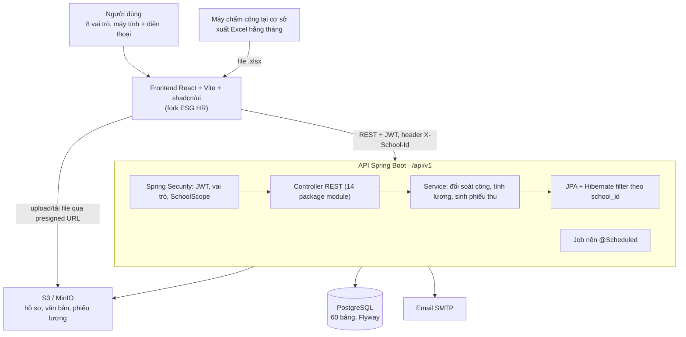
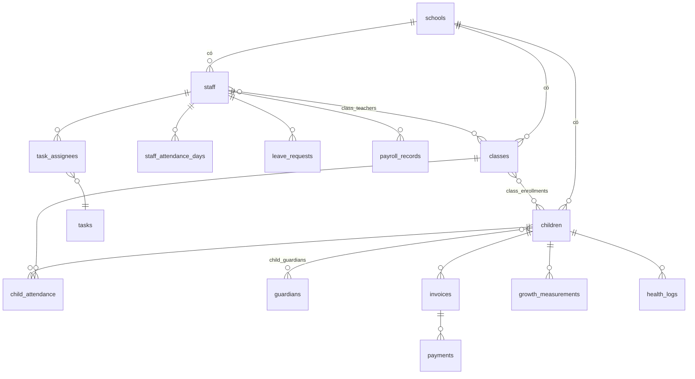

# Thiết kế hệ thống quản lý chuỗi trường mầm non

> Bản xuất từ tài liệu thiết kế trên Claude (cập nhật 2026-09-29). Đây là nguồn chuẩn cho mọi quyết định thiết kế; khi thay đổi, sửa file này trước.

Hệ thống web cho một chủ chuỗi quản lý nhiều cơ sở mầm non, dựng lại từ ESG HR: giữ phần lớn giao diện React, chuyển backend từ Supabase sang Java Spring Boot + PostgreSQL, gồm 10 module và làm theo 7 giai đoạn.

## Phạm vi và giả định

Một lần triển khai phục vụ một chuỗi: chủ chuỗi và văn phòng điều hành thấy mọi cơ sở, còn nhân sự mỗi cơ sở chỉ thấy cơ sở của mình.

- **Mô hình:** chuỗi trường cùng một chủ, không phải SaaS nhiều khách hàng. Mọi bảng nghiệp vụ mang cột `school_id`; dữ liệu dùng chung toàn chuỗi (năm học, ngày lễ, loại tài liệu, món ăn) để `school_id` rỗng.

- **Người dùng bản đầu:** chủ chuỗi, văn phòng điều hành, kế toán, hiệu trưởng/quản lý cơ sở, giáo viên, nhân viên y tế, cấp dưỡng và nhân viên khác.

- **Nền tảng:** web app chạy tốt trên máy tính và điện thoại (giáo viên điểm danh trẻ bằng điện thoại), chưa làm app mobile riêng.

- **Ngoài phạm vi bản đầu:** cổng/app phụ huynh, thanh toán học phí online qua cổng thanh toán, xuất hóa đơn điện tử, kết nối trực tiếp máy chấm công (vẫn import file Excel như ESG HR), sổ kế hoạch giáo dục/đánh giá trẻ. Thiết kế dữ liệu vẫn chừa sẵn chỗ cho phụ huynh (bảng `guardians` có `user_id`).

- **Quy định ngành:** sĩ số tối đa theo độ tuổi, định mức giáo viên/lớp, tỷ lệ đóng bảo hiểm, mức giảm trừ gia cảnh đều lưu trong bảng cấu hình có ngày hiệu lực, không viết cứng trong code. Điều lệ Trường mầm non (Thông tư 52/2020/TT-BGDĐT) đã được sửa đổi nhiều lần, gần nhất năm 2026, nên số liệu mặc định cần đối chiếu văn bản hiện hành trước khi nhập.

- **Địa chỉ:** dùng cấp tỉnh + phường/xã (34 tỉnh, không còn cấp huyện). File `addressData.json` của ESG HR đã theo cấu trúc này, nhưng kiểu `Employee` vẫn còn `perm_district`/`curr_district` — bỏ trong schema mới.

## Vai trò và phân quyền

Có 8 vai trò; mỗi lần gán vai trò cho một tài khoản kèm phạm vi là một cơ sở hoặc toàn chuỗi, nên một người có thể là kế toán cho hai cơ sở mà không cần vai trò mới.

| Vai trò                     | Mã            | Phạm vi gán                                 | Dùng cho                                        |
|-----------------------------|---------------|---------------------------------------------|-------------------------------------------------|
| Chủ chuỗi                   | `OWNER`       | Toàn chuỗi                                  | Xem mọi thứ, duyệt bảng lương, báo cáo tổng hợp |
| Văn phòng điều hành         | `CHAIN_ADMIN` | Toàn chuỗi                                  | Nhân sự, tài liệu chung, cấu hình, tài khoản    |
| Kế toán                     | `ACCOUNTANT`  | Toàn chuỗi hoặc từng cơ sở                  | Học phí, thu chi, lương                         |
| Hiệu trưởng / quản lý cơ sở | `PRINCIPAL`   | Một cơ sở                                   | Điều hành cơ sở, giao việc, duyệt nghỉ phép     |
| Giáo viên / bảo mẫu         | `TEACHER`     | Một cơ sở, giới hạn theo lớp được phân công | Điểm danh trẻ, cân đo, sổ theo dõi lớp          |
| Nhân viên y tế              | `NURSE`       | Một cơ sở                                   | Sức khỏe trẻ toàn cơ sở                         |
| Cấp dưỡng                   | `KITCHEN`     | Một cơ sở                                   | Thực đơn, số suất ăn                            |
| Nhân viên khác              | `STAFF`       | Một cơ sở                                   | Việc được giao, hồ sơ và công của bản thân      |

Ma trận quyền theo module. **Chuỗi** = đọc/ghi mọi cơ sở · **Cơ sở** = đọc/ghi trong phạm vi được gán · **Xem** = chỉ đọc trong phạm vi · **Lớp** = lớp được phân công · **Mình** = dữ liệu của bản thân · **—** = không truy cập.

| Module                        | OWNER         | CHAIN_ADMIN | ACCOUNTANT             | PRINCIPAL                 | TEACHER                   | NURSE          | KITCHEN          | STAFF          |
|-------------------------------|---------------|-------------|------------------------|---------------------------|---------------------------|----------------|------------------|----------------|
| Cơ sở, tài khoản, cấu hình    | Chuỗi         | Chuỗi       | Xem                    | Xem                       | —                         | —              | —                | —              |
| Nhân sự                       | Chuỗi         | Chuỗi       | Xem (lương, ngân hàng) | Cơ sở, trừ cấu hình lương | Mình                      | Mình           | Mình             | Mình           |
| Tài liệu                      | Chuỗi         | Chuỗi       | Cơ sở                  | Cơ sở                     | Xem + xác nhận đã đọc     | Xem + xác nhận | Xem + xác nhận   | Xem + xác nhận |
| Công việc                     | Chuỗi         | Chuỗi       | Mình                   | Cơ sở (giao việc)         | Mình                      | Mình           | Mình             | Mình           |
| Chấm công & nghỉ phép         | Xem           | Chuỗi       | Xem                    | Cơ sở (duyệt nghỉ)        | Mình (xin nghỉ)           | Mình           | Mình             | Mình           |
| Lớp học, hồ sơ trẻ, điểm danh | Xem           | Chuỗi       | Xem                    | Cơ sở                     | Lớp                       | Xem            | Xem (sĩ số)      | —              |
| Thực đơn & sức khỏe           | Xem           | Chuỗi       | —                      | Cơ sở                     | Lớp (cân đo, sổ theo dõi) | Cơ sở          | Cơ sở (thực đơn) | —              |
| Học phí & thu chi             | Xem           | Xem         | Cơ sở                  | Xem                       | —                         | —              | —                | —              |
| Lương & phiếu lương           | Chuỗi (duyệt) | Xem         | Cơ sở                  | Mình                      | Mình                      | Mình           | Mình             | Mình           |
| Báo cáo & dashboard           | Chuỗi         | Chuỗi       | Tài chính              | Cơ sở                     | —                         | —              | —                | —              |

Quyền kiểm tra ở backend, không dựa vào việc ẩn menu trên giao diện. Hiệu trưởng không xem lương người khác là mặc định đề xuất, cần chủ chuỗi xác nhận.

## Kiến trúc tổng thể

Frontend không còn nói chuyện trực tiếp với database như khi dùng Supabase: mọi quyền được kiểm tra ở API, riêng file đi thẳng lên storage bằng link ký do API cấp.

## Các module và nghiệp vụ chính

3 trong 10 module (nhân sự, chấm công, lương) đã có phần lớn nghiệp vụ trong ESG HR; 4 module (công việc, lớp & trẻ, học phí, thực đơn & sức khỏe) phải viết mới.

| \#  | Module                                                     | Nguồn từ ESG HR                                 | Giai đoạn |
|-----|------------------------------------------------------------|-------------------------------------------------|-----------|
| 1   | Nền tảng: đăng nhập, cơ sở, tài khoản, cấu hình, thông báo | Sửa (Login, layout)                             | 1         |
| 2   | Nhân sự                                                    | Tái sử dụng nhiều (hồ sơ 7 tab)                 | 2         |
| 3   | Tài liệu                                                   | Một phần (upload, loại tài liệu)                | 2         |
| 4   | Công việc                                                  | Viết mới                                        | 3         |
| 5   | Chấm công & nghỉ phép                                      | Tái sử dụng nhiều (bảng công, import, đối soát) | 3         |
| 6   | Lương & phiếu lương                                        | Tái sử dụng nhiều (tính lương, gửi email)       | 4         |
| 7   | Lớp học, hồ sơ trẻ, điểm danh                              | Viết mới                                        | 5         |
| 8   | Học phí & thu chi                                          | Viết mới                                        | 6         |
| 9   | Thực đơn & sức khỏe trẻ                                    | Viết mới                                        | 7         |
| 10  | Báo cáo & dashboard                                        | Viết lại (Dashboard)                            | 7         |

### 1. Nền tảng

- Đăng nhập bằng email **hoặc** số điện thoại + mật khẩu (một ô nhập, backend tự nhận dạng), quên mật khẩu qua email; tài khoản do văn phòng điều hành tạo, không tự đăng ký. Quên mật khẩu làm sau các phần cốt lõi của giai đoạn 1 (xem Lộ trình).

- Bộ chọn cơ sở trên header: vai trò cấp chuỗi chọn "Tất cả cơ sở" hoặc một cơ sở; vai trò cấp cơ sở bị khóa vào cơ sở của mình.

- Cấu hình dùng chung: năm học, ngày lễ (giữ danh sách ESG), loại tài liệu, tham số lương/bảo hiểm.

- Nhật ký thao tác (ai sửa gì, lúc nào) cho lương, học phí, hồ sơ trẻ.

- Thông báo trong app + email: việc được giao, đơn nghỉ chờ duyệt, tài liệu cần xác nhận, giấy tờ sắp hết hạn.

### 2. Nhân sự

- Giữ các tab hồ sơ ESG: thông tin cá nhân (quét CCCD), hồ sơ lao động, cấu hình lương, bảo hiểm & thuế, trình độ & đào tạo, thời gian làm việc.

- Thêm: vị trí (giáo viên, bảo mẫu, cấp dưỡng, y tế, kế toán, bảo vệ, quản lý), trình độ chuyên môn sư phạm mầm non, chứng chỉ bồi dưỡng, giấy khám sức khỏe định kỳ, tab "Phân công lớp".

- `staff.school_id` là cơ sở hiện tại; mỗi lần điều chuyển thêm một dòng `staff_school_assignments` kèm quyết định, nên bảng công và lương các tháng trước vẫn tính về đúng cơ sở cũ.

- Cấu hình lương tách thành bảng riêng có ngày hiệu lực, thay cho khoảng 15 cột lương/phụ cấp nằm trong bảng `employees` cũ; lịch sử điều chỉnh lương tự có.

- Cảnh báo trước 30 ngày khi hợp đồng, chứng chỉ hoặc giấy khám sức khỏe sắp hết hạn.

- Quyết định chi tiết (chốt 2026-09-30):
  - Thêm nhân viên: quét **mã QR trên CCCD gắn chip** ngay trong trình duyệt để điền số CCCD, họ tên, ngày sinh, giới tính, ngày cấp; địa chỉ trong QR là dạng cũ nên chỉ điền ô chi tiết. Ảnh 2 mặt lưu làm giấy tờ loại `CCCD`. Trùng CCCD/SĐT/email bị chặn toàn chuỗi.
  - Hiệu trưởng: thêm/sửa hồ sơ, hợp đồng, giấy tờ, chứng chỉ và **cho nghỉ việc** nhân viên cơ sở mình (khóa tài khoản); không xem/sửa lương, không điều chuyển, không tạo tài khoản đăng nhập (việc của văn phòng điều hành/chủ chuỗi). Kế toán xem hồ sơ, lương, ngân hàng nhưng không sửa. Nhân viên khác chỉ xem hồ sơ của mình.
  - Điều chuyển cơ sở được đặt ngày hiệu lực tương lai; job hằng ngày áp dụng khi tới ngày. Không đặt trước lần điều chuyển gần nhất.
  - Cấu hình lương chỉ thêm bản mới có ngày hiệu lực, không sửa đè bản cũ; mọi thay đổi hồ sơ và lương ghi `audit_logs`.
  - Nhân viên tự đề xuất cập nhật SĐT/địa chỉ (hiệu trưởng cơ sở hoặc văn phòng điều hành duyệt) và tài khoản ngân hàng (chỉ văn phòng điều hành hoặc kế toán duyệt).

### 3. Tài liệu

- **Hồ sơ gắn với người** (nhân viên, trẻ): theo danh mục `document_types` như ESG (`HOP_DONG_LAO_DONG`, `GIAY_KHAM_SUC_KHOE`…), thêm loại cho trẻ: giấy khai sinh, sổ tiêm chủng, thẻ BHYT, đơn nhập học.

- **Thư viện văn bản** của chuỗi/cơ sở: thư mục, số hiệu, ngày ban hành, ngày hết hiệu lực, phiên bản, phạm vi xem (toàn chuỗi / cơ sở / vai trò).

- Văn bản có thể bật "yêu cầu xác nhận đã đọc"; người ban hành xem ai chưa đọc và nhắc lại.

- Phạm vi xem văn bản = cơ sở (rỗng = toàn chuỗi) + danh sách vai trò (rỗng = mọi vai trò). Chủ chuỗi/văn phòng điều hành ban hành toàn chuỗi; hiệu trưởng, kế toán ban hành trong cơ sở mình. "Người cần đọc" là tài khoản gắn nhân viên đang làm thuộc phạm vi. Phiên bản mới có thể yêu cầu xác nhận lại. "Nhắc người chưa đọc" gửi thông báo trong app + email, tối đa 1 lần/ngày.

- File lưu trên object storage, tải về qua link ký có hạn (giống signed URL của Supabase đang dùng).

### 4. Công việc

- Giao cho một hoặc nhiều người, có hạn, ưu tiên, checklist, bình luận, đính kèm.

- Trạng thái: Mới → Đang làm → Chờ duyệt → Hoàn thành (hoặc Hủy); người giao duyệt bước cuối.

- Việc lặp lại tự sinh theo lịch (vệ sinh lớp hằng tuần, kiểm tra PCCC hằng tháng).

- Hai giao diện: bảng Kanban cho quản lý, danh sách "Việc của tôi" cho nhân viên.

### 5. Chấm công & nghỉ phép

- Giữ bộ mã công ESG (X, P, 1/2P, K, 1/2K, O, CO, TS, T, NL, NB, NN), import Excel máy chấm công và đối soát đi muộn (số phút ân hạn, số lần muộn cho phép).

- Cấu hình ca theo từng cơ sở (trường mầm non thường có ca đón sớm, ca trả muộn).

- Thêm đơn xin nghỉ có duyệt: hiệu trưởng duyệt xong hệ thống tự ghi mã P/1/2P/K vào bảng công và trừ ngày phép còn lại.

- Khóa công tháng trước khi tính lương; mở khóa cần quyền cấp chuỗi và ghi nhật ký.

- Chuyển logic đối soát (`attendanceReconciliation.ts`) về backend để bảng công và bảng lương dùng cùng một kết quả; frontend chỉ còn đọc file Excel.

### 6. Lương & phiếu lương

- Giữ luồng ESG: lương cơ bản × công thực tế / công chuẩn + phụ cấp + thưởng − phạt; trạng thái Nháp → Đã duyệt → Đã trả; gửi phiếu lương qua email.

- Bổ sung phần ESG chưa có: khấu trừ BHXH/BHYT/BHTN phần người lao động, thuế TNCN (giảm trừ bản thân và người phụ thuộc đã có dữ liệu), phụ cấp thâm niên và chức vụ (ESG có trường nhưng công thức chưa cộng vào).

- Tỷ lệ và mức giảm trừ lấy từ bảng `payroll_params` theo ngày hiệu lực.

- Chủ chuỗi duyệt trước khi trả lương, bảng đã duyệt không sửa được; phiếu lương xuất PDF; nhân viên xem phiếu của mình trong app.

### 7. Lớp học, hồ sơ trẻ, điểm danh

- Năm học → khối theo độ tuổi (nhà trẻ, mẫu giáo 3–4, 4–5, 5–6 tuổi) có sĩ số tối đa → lớp → giáo viên phụ trách.

- Hồ sơ trẻ: thông tin cá nhân, mã định danh, BHYT, ghi chú dị ứng/lưu ý, phụ huynh và danh sách người được phép đón.

- Trạng thái trẻ: Đang học, Bảo lưu, Đã nghỉ, Hoàn thành; lịch sử chuyển lớp; lên lớp hàng loạt đầu năm học.

- Điểm danh sáng trên điện thoại: Có mặt / Vắng có phép / Vắng không phép, giờ đến, giờ về, người đón.

- Chốt điểm danh trước giờ báo ăn (cấu hình theo cơ sở) để cấp dưỡng có số suất và học phí có số ngày vắng.

### 8. Học phí & thu chi

- Danh mục khoản thu theo cách tính: cố định theo tháng (học phí), theo ngày (tiền ăn), một lần (đồng phục, cơ sở vật chất), tự chọn (năng khiếu).

- Biểu phí theo cơ sở, năm học và khối; miễn giảm theo trẻ (anh chị em, con nhân viên) có thời hạn.

- Sinh phiếu thu hàng loạt mỗi tháng: tiền ăn tạm tính theo số ngày học dự kiến, hoàn lại ngày vắng có phép tháng trước theo quy tắc cấu hình, cộng nợ cũ.

- Ghi nhận thanh toán nhiều lần (tiền mặt, chuyển khoản), công nợ theo trẻ, in/gửi thông báo học phí, xuất Excel.

- Sổ thu chi khác theo danh mục (thực phẩm, điện nước, sửa chữa) có chứng từ; lương đã trả tự vào sổ chi.

### 9. Thực đơn & sức khỏe trẻ

- Danh mục món ăn kèm nguyên liệu và giá trị dinh dưỡng (kcal, đạm, béo, bột đường) mỗi suất.

- Thực đơn tuần theo cơ sở và khối, sao chép từ tuần trước; số suất = số trẻ có mặt đã chốt.

- Cân đo định kỳ: hệ thống xếp kênh cân nặng/tuổi, chiều cao/tuổi, BMI/tuổi theo chuẩn tăng trưởng WHO và vẽ biểu đồ tăng trưởng của trẻ.

- Khám sức khỏe định kỳ, sổ theo dõi hằng ngày (sốt, dặn thuốc, sự cố nhỏ) có ô "đã báo phụ huynh".

- Trẻ có ghi chú dị ứng hiện cảnh báo ở màn hình điểm danh và thực đơn.

### 10. Báo cáo & dashboard

- Dashboard chuỗi: sĩ số theo cơ sở, tỷ lệ đi học trong ngày, nhân sự, công nợ học phí, thu chi tháng, việc quá hạn.

- Dashboard cơ sở: cùng chỉ số, giới hạn một cơ sở; so sánh giữa các cơ sở chỉ dành cho cấp chuỗi.

- Xuất Excel cho bảng công, bảng lương, công nợ, danh sách trẻ.

## Mô hình dữ liệu

60 bảng PostgreSQL, quản lý bằng Flyway migration. Repo ESG HR không có file schema nào, nên đây là schema viết mới, dựa trên các bảng mà code cũ truy vấn.

Quy ước chung: khóa chính `id` kiểu UUID; mọi bảng có `created_at`, `updated_at`, `created_by`; bảng nghiệp vụ có `school_id` (rỗng = dùng chung toàn chuỗi); nhân viên, trẻ, phiếu thu xóa mềm bằng `deleted_at`; tiền lưu `numeric(14,0)` (đồng); cột dạng trạng thái dùng `varchar` + CHECK thay vì enum của Postgres để dễ migration.

| Module    | Bảng                        | Cột chính / ghi chú                                                                                                                                                                                          | Thay cho bảng ESG                                |
|-----------|-----------------------------|--------------------------------------------------------------------------------------------------------------------------------------------------------------------------------------------------------------|--------------------------------------------------|
| Nền tảng  | `schools`                   | code, name, province_code, ward_code (mã theo `addressData.json`), address_detail, phone, license_no, is_active                                                                                                                              | —                                                |
| Nền tảng  | `users`                     | email (unique), phone? (unique, chỉ chữ số), full_name, password_hash, staff_id?, guardian_id?, is_active, last_login_at — đăng nhập bằng email hoặc phone                                                    | Supabase Auth                                    |
| Nền tảng  | `user_roles`                | user_id, role_code, school_id? (rỗng = toàn chuỗi)                                                                                                                                                           | —                                                |
| Nền tảng  | `refresh_tokens`            | user_id, token_hash, family_id (chuỗi token xoay vòng), remember_me, expires_at, revoked_at                                                                                                                  | —                                                |
| Nền tảng  | `password_reset_tokens`     | user_id, token_hash, expires_at (30 phút), used_at — link quên mật khẩu dùng một lần                                                                                                                        | —                                                |
| Nền tảng  | `school_years`              | name (2026–2027), start_date, end_date, is_current                                                                                                                                                           | —                                                |
| Nền tảng  | `holidays`                  | school_id?, holiday_date, name, is_custom                                                                                                                                                                    | `holidays`                                       |
| Nền tảng  | `notifications`             | user_id, type, title, body, link, read_at, dedupe_key (không tạo trùng thông báo của job)                                                                                                                                                                    | —                                                |
| Nền tảng  | `audit_logs`                | user_id, entity, entity_id, action (CREATE / UPDATE / DELETE), before_data/after_data (jsonb); thời điểm = created_at                                                                                         | —                                                |
| Tài liệu  | `files`                     | school_id? (rỗng = dùng chung toàn chuỗi), storage_key, original_name, mime_type, size_bytes, status (PENDING / READY), uploaded_by — chỉ file READY mới tải được                                             | Supabase Storage                                 |
| Tài liệu  | `document_types`            | code, name, scope (STAFF / CHILD / LIBRARY), has_expiry                                                                                                                                                      | `document_types`                                 |
| Tài liệu  | `staff_documents`           | staff_id, document_type_id, file_id, issued_date, expiry_date                                                                                                                                                | `employee_documents`                             |
| Tài liệu  | `child_documents`           | child_id, document_type_id, file_id, expiry_date                                                                                                                                                             | —                                                |
| Tài liệu  | `doc_folders`               | school_id?, parent_id, name                                                                                                                                                                                  | —                                                |
| Tài liệu  | `library_documents`         | folder_id, school_id?, title, doc_number, issued_date, effective_to, visible_roles (rỗng = mọi vai trò), require_ack, ack_version_no (phiên bản cần xác nhận lại)                                                                                                                 | —                                                |
| Tài liệu  | `library_document_versions` | document_id, version_no, file_id, note                                                                                                                                                                       | —                                                |
| Tài liệu  | `document_acks`             | document_id, staff_id, version_no, acknowledged_at                                                                                                                                                                       | —                                                |
| Nhân sự   | `staff`                     | school_id, staff_code, full_name, dob, gender, citizen_id, phone, email, địa chỉ thường trú/hiện tại (không cấp huyện), position, qualification, bank\_\*, social_insurance_no, start_date, end_date, status (ACTIVE / TERMINATED), photo_file_id, citizen_id_issued_on, personal_tax_code, health_insurance_no, termination_reason, deleted_at | `employees`                                      |
| Nhân sự   | `staff_school_assignments`  | staff_id, school_id, from_date, to_date, decision_file_id                                                                                                                                                    | —                                                |
| Nhân sự   | `staff_contracts`           | staff_id, contract_type, contract_no, start_date, end_date, file_id                                                                                                                                          | cột trong `employees`                            |
| Nhân sự   | `staff_salary_configs`      | staff_id, effective_from, salary_mode, base_salary, coefficient, region, allowances (jsonb), insurance_salary                                                                                                | cột trong `employees` + `salary_adjustments`     |
| Nhân sự   | `staff_dependents`          | staff_id, full_name, relationship, dob, id_number, from_month, to_month                                                                                                                                      | `dependents`                                     |
| Nhân sự   | `staff_certificates`        | staff_id, name, issued_by, issue_date, expiry_date, file_id                                                                                                                                                  | jsonb trong `employees`                          |
| Nhân sự   | `staff_trainings`           | staff_id, course_name, provider, start_date, end_date, result, file_id                                                                                                                                       | jsonb trong `employees`                          |
| Nhân sự   | `staff_change_requests`      | staff_id, school_id, changes (jsonb: SĐT, địa chỉ, ngân hàng), status (PENDING / APPROVED / REJECTED), reviewed_by, reviewed_at, note — nhân viên tự đề xuất cập nhật | — |
| Công việc | `tasks`                     | school_id?, title, description, priority, status, due_at, created_by, parent_id, recurrence_rule                                                                                                             | —                                                |
| Công việc | `task_assignees`            | task_id, staff_id, status, done_at                                                                                                                                                                           | —                                                |
| Công việc | `task_checklist_items`      | task_id, content, is_done, order_no                                                                                                                                                                          | —                                                |
| Công việc | `task_comments`             | task_id, user_id, body, file_id?                                                                                                                                                                             | —                                                |
| Chấm công | `attendance_configs`        | school_id, shift_start, shift_end, lunch_start, lunch_end, late_grace_minutes, max_late_count_allowed, working_weekdays                                                                                      | `attendance_config`                              |
| Chấm công | `attendance_import_batches` | school_id, month, file_id, imported_by, row_count                                                                                                                                                            | —                                                |
| Chấm công | `attendance_punches`        | batch_id, staff_id, work_date, check_in, check_out                                                                                                                                                           | `attendance_raw_machine`                         |
| Chấm công | `staff_attendance_days`     | staff_id, work_date, status_code, late_minutes, is_counted_late, is_discrepancy, note, leave_time, return_time, confirmed_by                                                                                 | `attendance_manual` + `daily_attendance_summary` |
| Chấm công | `staff_attendance_months`   | staff_id, month, total_work, paid_leave, unpaid_leave, holiday_leave, late_count, locked_at                                                                                                                  | `attendance_monthly_summaries`                   |
| Chấm công | `leave_balances`            | staff_id, year, annual_days, used_days                                                                                                                                                                       | cột trong `employees`                            |
| Chấm công | `leave_requests`            | staff_id, leave_code, from_date, to_date, half_day, reason, status, approved_by, approved_at                                                                                                                 | —                                                |
| Lương     | `payroll_params`            | effective_from, bhxh/bhyt/bhtn employee rate, personal_deduction, dependent_deduction, pit_brackets (jsonb)                                                                                                  | —                                                |
| Lương     | `payroll_periods`           | school_id, month, standard_work_days, status (DRAFT / APPROVED / PAID), approved_by                                                                                                                          | —                                                |
| Lương     | `payroll_records`           | period_id, staff_id, work_days, base_salary, allowances, bonus, fines, insurance_deduction, taxable_income, pit, net_salary, is_paid, paid_at, email_sent_at, payslip_file_id                                | `payroll_records`                                |
| Lớp & trẻ | `age_groups`                | code, name, min_months, max_months, max_class_size                                                                                                                                                           | —                                                |
| Lớp & trẻ | `classes`                   | school_id, school_year_id, age_group_id, name, room, capacity                                                                                                                                                | —                                                |
| Lớp & trẻ | `class_teachers`            | class_id, staff_id, role (MAIN / ASSISTANT), from_date, to_date                                                                                                                                              | —                                                |
| Lớp & trẻ | `children`                  | school_id, child_code, full_name, nickname, dob, gender, personal_id, health_insurance_no, địa chỉ, allergy_note, status, enrolled_at, left_at                                                               | —                                                |
| Lớp & trẻ | `guardians`                 | full_name, phone, email, citizen_id, user_id? (cổng phụ huynh sau này)                                                                                                                                       | —                                                |
| Lớp & trẻ | `child_guardians`           | child_id, guardian_id, relationship, is_primary, can_pick_up                                                                                                                                                 | —                                                |
| Lớp & trẻ | `class_enrollments`         | child_id, class_id, from_date, to_date                                                                                                                                                                       | —                                                |
| Lớp & trẻ | `child_attendance`          | child_id, class_id, attend_date, status, check_in_at, check_out_at, picked_up_by, note, locked_at                                                                                                            | —                                                |
| Sức khỏe  | `growth_measurements`       | child_id, measured_on, weight_kg, height_cm, age_months, weight_status, height_status, bmi_status                                                                                                            | —                                                |
| Sức khỏe  | `who_growth_standards`      | indicator, gender, age_months, sd3neg … sd3                                                                                                                                                                  | —                                                |
| Sức khỏe  | `health_checkups`           | child_id, checkup_date, provider, summary, file_id                                                                                                                                                           | —                                                |
| Sức khỏe  | `health_logs`               | child_id, log_date, type (SỐT / THUỐC / SỰ_CỐ / KHÁC), content, parent_notified_at, recorded_by                                                                                                              | —                                                |
| Thực đơn  | `dishes`                    | name, ingredients (jsonb), kcal, protein_g, fat_g, carb_g                                                                                                                                                    | —                                                |
| Thực đơn  | `menus`                     | school_id, age_group_id?, week_start, status                                                                                                                                                                 | —                                                |
| Thực đơn  | `menu_items`                | menu_id, menu_date, meal (SÁNG / TRƯA / CHIỀU / PHỤ), dish_id                                                                                                                                                | —                                                |
| Học phí   | `fee_types`                 | code, name, calc_method (MONTHLY / PER_DAY / ONE_TIME / OPTIONAL), refundable_on_absence                                                                                                                     | —                                                |
| Học phí   | `fee_schedules`             | school_id, school_year_id, age_group_id?, fee_type_id, amount, effective_from                                                                                                                                | —                                                |
| Học phí   | `child_fee_items`           | child_id, fee_type_id, from_month, to_month (khoản tự chọn trẻ đăng ký)                                                                                                                                      | —                                                |
| Học phí   | `child_discounts`           | child_id, fee_type_id?, percent, amount, reason, from_month, to_month                                                                                                                                        | —                                                |
| Học phí   | `invoices`                  | school_id, child_id, period_month, subtotal, discount, carried_balance, amount_due, amount_paid, status (DRAFT / ISSUED / PARTIAL / PAID / CANCELLED), due_date                                              | —                                                |
| Học phí   | `invoice_lines`             | invoice_id, fee_type_id, quantity, unit_price, amount, note                                                                                                                                                  | —                                                |
| Học phí   | `payments`                  | invoice_id, amount, method, paid_at, reference, received_by                                                                                                                                                  | —                                                |
| Thu chi   | `cash_categories`           | direction (IN / OUT), name                                                                                                                                                                                   | —                                                |
| Thu chi   | `cash_entries`              | school_id, category_id, direction, amount, entry_date, description, source (MANUAL / PAYMENT / PAYROLL), source_id, file_id                                                                                  | —                                                |

Sơ đồ chỉ vẽ trục chính; tài khoản (`users`) nối với `staff` hoặc `guardians`, còn cấu hình và danh mục nằm trong bảng ở trên.

## Backend Spring Boot

Một ứng dụng Spring Boot duy nhất (modular monolith), chia package theo module; đủ cho một chuỗi vài chục cơ sở và dễ tách service sau nếu cần.

**Công nghệ:** Java 21, Spring Boot 4.0, Spring Web, Spring Data JPA, Spring Security, Flyway, Bean Validation, MapStruct, springdoc-openapi (Swagger), Spring Mail, Apache POI (Excel), OpenPDF (phiếu lương, phiếu thu), AWS SDK S3 (chạy với S3 hoặc MinIO), Testcontainers cho test tích hợp.

**Cấu trúc package** (mỗi module có `controller`, `service`, `repository`, `entity`, `dto`):

    com.preschool
    ├── common      // lỗi chuẩn, phân trang, audit, file storage, email
    ├── security    // JWT, SchoolScope, @PreAuthorize helpers
    ├── school      // cơ sở, năm học, ngày lễ, cấu hình
    ├── account     // users, roles, đăng nhập
    ├── staff       // hồ sơ, hợp đồng, lương cấu hình
    ├── document    // hồ sơ file, thư viện văn bản
    ├── task
    ├── attendance  // chấm công NV, đối soát, nghỉ phép
    ├── payroll
    ├── classroom   // lớp, trẻ, phụ huynh, điểm danh trẻ
    ├── health      // cân đo, sức khỏe, thực đơn
    ├── finance     // khoản thu, phiếu thu, thanh toán, sổ thu chi
    ├── report
    └── notification

**Xác thực:** access token JWT 15 phút gửi qua header `Authorization`; refresh token 7 ngày trong cookie httpOnly, lưu hash ở `refresh_tokens` để thu hồi khi đăng xuất hoặc khóa tài khoản; mật khẩu BCrypt.

**Lọc dữ liệu theo cơ sở** (điểm dễ sai nhất):

1.  Filter đọc JWT, nạp danh sách `(role, school_id)` của người dùng vào `SchoolScope` theo request.

2.  Frontend gửi cơ sở đang chọn qua header `X-School-Id`; backend từ chối nếu cơ sở đó không nằm trong scope.

3.  Mọi query bảng nghiệp vụ đi qua Hibernate `@Filter` theo `school_id` được bật tự động, nên quên thêm điều kiện cũng không lộ dữ liệu cơ sở khác.

4.  Quyền chi tiết (lớp mình, dữ liệu của mình) kiểm tra trong service bằng `@PreAuthorize("@perm.canEditClass(#classId)")`.

5.  Test tích hợp bắt buộc cho mỗi endpoint: user cơ sở A gọi dữ liệu cơ sở B phải nhận 403/404.

**Quy ước API:** REST dưới `/api/v1`, phân trang `?page=&size=&sort=`, lỗi theo chuẩn RFC 7807 (`application/problem+json`) với thông điệp tiếng Việt. Frontend sinh kiểu TypeScript từ OpenAPI (`openapi-typescript`) thay cho việc tự khai báo kiểu như `types/index.ts` hiện nay.

| Nhóm          | Endpoint tiêu biểu                                                                                                                           |
|---------------|----------------------------------------------------------------------------------------------------------------------------------------------|
| Xác thực      | `POST /auth/login`, `POST /auth/refresh`, `POST /auth/logout`, `GET /me`, `POST /auth/forgot-password`, `POST /auth/reset-password`          |
| File          | `POST /files/upload-url` (kiểm tra kích thước + loại file, tạo bản ghi PENDING, trả presigned URL), `POST /files/{id}/complete` (kiểm tra object trên storage đúng kích thước/loại đã khai báo → READY, sai thì xóa), `GET /files/{id}/download-url` |
| Nhân sự       | `GET/POST /staff`, `GET/PUT /staff/{id}`, `POST /staff/{id}/transfer`, `POST /staff/{id}/terminate`, `GET/POST /staff/{id}/salary-configs`, `GET/POST /staff/{id}/documents`, `GET /staff/expiring-documents`, `GET /staff/export`, `POST /me/change-requests`                                      |
| Tài liệu      | `GET/POST /library/documents`, `POST /library/documents/{id}/versions`, `POST /library/documents/{id}/ack`                                   |
| Công việc     | `GET/POST /tasks`, `PATCH /tasks/{id}/status`, `POST /tasks/{id}/comments`                                                                   |
| Chấm công     | `POST /attendance/imports`, `GET /attendance/staff?month=`, `PUT /attendance/staff/{staffId}/{date}`, `POST /attendance/months/{month}/lock` |
| Nghỉ phép     | `POST /leave-requests`, `POST /leave-requests/{id}/approve`, `.../reject`                                                                    |
| Lương         | `POST /payroll/periods/{month}/calculate`, `POST .../approve`, `POST .../send-payslips`                                                      |
| Lớp & trẻ     | `GET/POST /classes`, `GET/POST /children`, `POST /classes/promote` (lên lớp hàng loạt)                                                       |
| Điểm danh trẻ | `GET /classes/{id}/attendance?date=`, `PUT /classes/{id}/attendance` (cả lớp một lần), `POST .../lock`                                       |
| Sức khỏe      | `POST /children/{id}/measurements`, `GET /children/{id}/growth-chart`, `POST /children/{id}/health-logs`                                     |
| Thực đơn      | `GET/PUT /menus?week=`, `POST /menus/{id}/copy`, `GET /menus/{id}/portions`                                                                  |
| Học phí       | `POST /invoices/generate?month=`, `POST /invoices/{id}/issue`, `POST /invoices/{id}/payments`, `GET /receivables`                            |
| Báo cáo       | `GET /reports/dashboard`, `GET /reports/{name}/export` (Excel)                                                                               |

**Việc chạy nền** (`@Scheduled`, sau này có thể chuyển sang ShedLock nếu chạy nhiều instance): sinh việc lặp lại mỗi sáng, quét giấy tờ sắp hết hạn hằng ngày, nhắc phiếu thu quá hạn hằng tuần.

**Triển khai:** Docker Compose gồm `api`, `postgres`, `minio` cho môi trường dev; production có thể dùng AWS (EC2 hoặc ECS + RDS PostgreSQL + S3) và frontend trên Vercel hoặc S3 + CloudFront.

## Tái sử dụng frontend từ ESG HR

Giữ stack React 18 + Vite + TypeScript + shadcn/ui + Tailwind; việc lớn nhất là thay mọi lời gọi `supabase.from(...)` (khoảng 70 chỗ trong 11 file: phần lớn ở `hooks/` và `lib/`, số còn lại nằm thẳng trong component upload và chấm công) bằng API client gọi Spring Boot, dùng TanStack Query đã có sẵn trong dự án.

| Phần trong ESG HR                                                                               | Xử lý                | Ghi chú                                                                                             |
|-------------------------------------------------------------------------------------------------|----------------------|-----------------------------------------------------------------------------------------------------|
| `components/ui/*`, `NavLink`, `lib/utils`, `hooks/useMobile`, `useToast`                        | Giữ nguyên           | Thư viện giao diện shadcn                                                                           |
| `components/layout/*` (Sidebar, Header)                                                         | Sửa                  | Menu theo vai trò, bộ chọn cơ sở, bỏ chữ "ENSOGO Portal", đổi màu/logo                              |
| `contexts/AuthContext`, `service/authService`, `lib/supabase`, `lib/authHelpers`, `pages/Login` | Viết lại             | Gọi `/auth/*`, access token trong bộ nhớ, tự refresh; `AuthContext` thêm vai trò và cơ sở đang chọn |
| `lib/fileUploader`, `employees/shared/*UploadField`, `FileViewButton`                           | Sửa                  | Giữ UI, đổi Supabase Storage sang presigned URL từ API; dùng chung cho nhân viên và trẻ             |
| `employees/shared/CCCDUploadModal`, `DatePickerCustom`, `ConfirmModal`                          | Giữ                  | Dùng cho cả hồ sơ phụ huynh                                                                         |
| `employees/EmployeeModal` + 7 tab                                                               | Sửa → `StaffModal`   | Gộp tab An toàn vào hồ sơ; thêm tab Phân công lớp, Chứng chỉ sư phạm; bỏ trường quận/huyện          |
| `employees/schemas/employeeFormSchema` (zod)                                                    | Sửa                  | Tách phần lương ra form riêng theo `staff_salary_configs`                                           |
| `pages/Attendance`, `components/attendance/*`                                                   | Giữ UI               | Lấy dữ liệu từ API; thêm tab Đơn nghỉ                                                               |
| `lib/attendanceReconciliation`, `data/attendanceTypes`                                          | Chuyển logic về Java | Giữ bảng mã công ở frontend để hiển thị màu/nhãn                                                    |
| `pages/Payroll`, `pages/Payslips`, `hooks/usePayrollData`                                       | Giữ UI               | Công thức tính lương chuyển về backend                                                              |
| `api/send-salary-emails`, `api/_lib/emailService`, `service/emailService`                       | Chuyển sang Java     | Spring Mail; giữ mẫu HTML email                                                                     |
| `data/addressDataLoader` + `public/addressData.json`, `bankData`, `vietnameseHolidays`          | Giữ                  | Dữ liệu địa chỉ đã theo 34 tỉnh + phường/xã                                                         |
| `pages/Dashboard`                                                                               | Viết lại             | Chỉ số chuỗi/cơ sở, giữ cách dùng Recharts                                                          |
| `pages/Settings`                                                                                | Sửa                  | Cơ sở, năm học, khối, khoản thu, ca làm việc, ngày lễ                                               |
| `lovable-tagger`, README của Lovable, `vercel.json` (API functions), `@supabase/supabase-js`    | Bỏ                   |                                                                                                     |

Trang mới cần viết: Tài liệu, Công việc (Kanban + Việc của tôi), Lớp học, Hồ sơ trẻ, Điểm danh trẻ (tối ưu điện thoại), Thực đơn, Sức khỏe, Học phí, Thu chi, Quản lý tài khoản.

## Lộ trình

| Giai đoạn | Tuần (ước lượng) | Xong khi |
| --- | --- | --- |
| 1. Nền tảng | 1–2 | Đăng nhập, phân quyền theo cơ sở chạy được |
| 2. Nhân sự + Tài liệu | 3–5 | Hồ sơ NV và file chạy trên API mới |
| 3. Chấm công, nghỉ phép, công việc | 6–8 | Bảng công khớp kết quả ESG HR cũ |
| 4. Lương & phiếu lương | 9–10 | Lương 1 tháng thật khớp tính tay |
| 5. Lớp, hồ sơ trẻ, điểm danh | 11–13 | GV điểm danh cả lớp trên điện thoại |
| 6. Học phí & thu chi | 14–16 | Phiếu thu 1 tháng khớp sổ kế toán |
| 7. Thực đơn, sức khỏe, dashboard | 17–19 | Chủ chuỗi xem đủ số liệu mọi cơ sở |

Module có sẵn từ ESG HR đi trước để sớm có bản dùng được; học phí đứng sau điểm danh trẻ vì tiền ăn tính từ số ngày vắng. Số tuần là ước lượng, cần chỉnh theo thời gian thực tế bạn có; có hai người thì giai đoạn 5 chạy song song được với 3–4, rút còn khoảng 16 tuần.

Giai đoạn 1 gồm:

- Backend: dựng project Spring Boot, Flyway với các bảng nền tảng, đăng nhập JWT, `SchoolScope` + Hibernate filter, upload file qua presigned URL, Docker Compose.

- Frontend: fork repo ESG HR, bỏ Supabase và Lovable, thêm API client + TanStack Query, `AuthContext` mới, bộ chọn cơ sở, đổi tên và thương hiệu.

- Test tích hợp chặn truy cập chéo cơ sở chạy trong CI ngay từ đầu.

- Quên mật khẩu qua email làm sau cùng trong giai đoạn 1 (hoặc chuyển sang giai đoạn 2); trong lúc chờ, link "Quên mật khẩu?" hướng dẫn liên hệ văn phòng điều hành.

## Câu hỏi cần chốt trước khi code

- Chuỗi hiện có bao nhiêu cơ sở, khoảng bao nhiêu trẻ và nhân viên? (ảnh hưởng cấu hình server, không đổi thiết kế)

- Hiệu trưởng có được xem lương nhân viên cơ sở mình không?

- Học phí thu tại từng cơ sở hay kế toán chuỗi thu tập trung? Biểu phí giống nhau giữa các cơ sở hay khác?

- Quy tắc hoàn tiền ăn: hoàn theo mọi ngày vắng có phép, hay chỉ khi báo trước giờ báo ăn, hay từ ngày vắng thứ N?

- Máy chấm công ở các cơ sở có xuất cùng định dạng Excel với file ESG HR đang đọc không?

- Công thức lương: chuỗi dùng lương cứng, lương hệ số hay cả hai? Có phụ cấp đặc thù (đứng lớp, trả muộn, ngày thứ Bảy) không?

- Cổng phụ huynh có nằm trong kế hoạch năm nay không? Nếu có, nên làm sau giai đoạn 6.

- Tên sản phẩm, logo, màu thương hiệu của chuỗi.

- Triển khai trên AWS hay máy chủ riêng/VPS?

## Nhật ký thay đổi thiết kế

| Ngày | Thay đổi | Lý do |
| --- | --- | --- |
| 2026-09-29 | Spring Boot 3 → 4.0 | Nhánh 3.x hết hỗ trợ OSS; dự án mới nên chọn luôn bản đang được hỗ trợ |
| 2026-09-29 | `users` thêm `phone`, `full_name`; đăng nhập bằng email hoặc SĐT | ESG HR đang đăng nhập bằng SĐT, giữ thói quen người dùng |
| 2026-09-29 | `files` thêm `school_id`, `status`; thêm `POST /files/{id}/complete` | Cần `school_id` để chặn tải file chéo cơ sở; bước complete chặn file quá lớn/sai loại và file upload dở |
| 2026-09-29 | Package gốc `com.preschool` | Chốt tên package |
| 2026-09-29 | Quên mật khẩu làm sau cùng trong giai đoạn 1 | Ưu tiên luồng đăng nhập + phân quyền cơ sở |
| 2026-09-29 | Chi tiết hóa khi viết V1: `refresh_tokens` thêm `family_id`, `remember_me`; `audit_logs.at` → `created_at`, `before/after` → `before_data/after_data`; `schools` lưu mã tỉnh/phường | Phục vụ xoay vòng refresh token + "Ghi nhớ đăng nhập"; thống nhất quy ước cột chung |
| 2026-09-29 | Dùng Spring Boot 4.0.8 (4.1.x đã có) | Giữ đúng quyết định 4.0; springdoc 3.0.x chỉ build cho 4.0. Nâng 4.1 là bước nhỏ, làm khi cần |
| 2026-09-29 | MinIO dev dùng image `chainguard/minio` | MinIO ngừng phát hành image community trên Docker Hub/Quay |
| 2026-09-29 | Thêm bảng `password_reset_tokens` (V2) và API forgot/reset password; dev dùng Mailpit bắt email | Quên mật khẩu qua email (module Nền tảng); token dùng một lần, chỉ lưu hash |
| 2026-09-30 | Giai đoạn 2: `staff` thêm photo_file_id, citizen_id_issued_on, personal_tax_code, health_insurance_no, termination_reason; bảng mới `staff_change_requests`; `notifications.dedupe_key`; `library_documents.visible_roles`, `ack_version_no`; `document_acks.version_no`; `users.staff_id` thành FK | Quét CCCD, cho nghỉ việc, tự phục vụ, job cảnh báo hết hạn không trùng, phạm vi xem theo vai trò, xác nhận lại khi có phiên bản mới |
| 2026-09-30 | `library_documents` thêm `current_version_no` (số phiên bản mới nhất) và `last_reminded_at` (giới hạn nhắc 1 lần/ngày); `doc_folders` không trùng tên trong cùng thư mục cha; API thư viện: `/library/folders`, `/library/documents` (+ `/versions`, `/ack`, `/readers`, `/remind`, `/versions/{no}/download-url`) | Chi tiết hóa khi viết V4 cho các hành vi đã chốt (phiên bản, xác nhận lại, nhắc người chưa đọc) |
| 2026-09-30 | Quyền nhân sự chi tiết (hiệu trưởng được cho nghỉ việc; điều chuyển/lương/tài khoản chỉ cấp chuỗi), duyệt đề xuất, điều chuyển ngày tương lai | Chủ dự án chốt khi lập kế hoạch giai đoạn 2 |

## Nguồn

- Mã nguồn ESG-HR-system (file zip bạn gửi): cấu trúc, bảng Supabase được truy vấn, luồng chấm công và tính lương.

- [Thông tư 52/2020/TT-BGDĐT về Điều lệ Trường mầm non — LuatVietnam](https://luatvietnam.vn/giao-duc/thong-tu-52-2020-tt-bgddt-ve-dieu-le-truong-mam-non-200235-d1.html): còn hiệu lực, đã sửa đổi bởi Thông tư 09/2025, 15/2025 và 51/2026.
